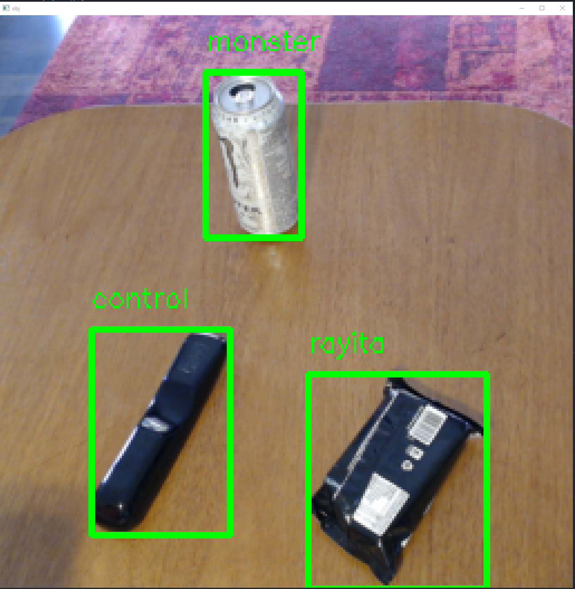

# Computer vision Experiments

### First experiments using OpenCV and PyTorch.

The idea of this repo is to test out some computer vision techniques to later use them as a tool/controller for the robot arm I am developing.
Repo of the robot arm.

The main objectives to solve are:

1. Given a static camera with a static background, detect new objects that enter it's FOV (field of view).
2. Quick way to define types and new objects to detect (Be able to train the model only with data gathered within a few minutes of a training prodecure).
3. Classify objects mentioned in (1) using the gathered data mentioned in (2).

[Robot Arm](https://github.com/alberto-abarzua/3d_printed_robot_arm)

## For the first aproach the following workflow was used. This is divided in to main sections.

### Training sequence:

1. Define the background of the inital scene. (Startup the camera without any objects in it's FOV)
2. Define the objects the model should be able to detect and classify. For each object place it individually in the camere's FOV and take pictures of it in various positions and orientations (using the same cropping and ROI described in "Running the object detection".
3. Use data augmentation techniques to increase the size of the training data and improve generalization.
4. Train the model used with this gathered data.

### Running the object detection:

1. Define the background of the inital scene. (Startup the camera without any objects in it's FOV)
2. For each new frame detect the difference between it and the background. The countours created with this difference will be the detected objects.
3. Determine bounding boxes for each object detectec and extract a region of interest from it (ROI).
4. Use a CNN  (in this case a modified version of DenseNet-121 implemented using pytorch), to classifie each ROI
5. Output the bounding boxes and the prediccion to the output frame (screen live camera)

## About the CNN model used.

A modified version of DenseNet-121 was implemented using pytorch. This model takes as an input images (RGB) of size 32 (3,32,32) used to classify the several classes defined in "Training sequence"
## Sample dataset examples

# Some examples.

## Object segmentation process.

## Various objects in the same frame.
  
## Video demo.

